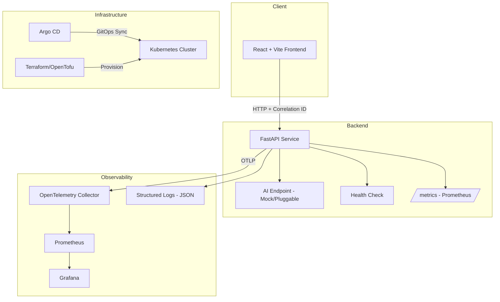

# AI DevOps Platform Lab

> A production-grade AI full-stack application with complete DevOps, observability, security scanning, infrastructure-as-code, and GitOps-ready deployment — built as a portfolio demonstration of platform engineering practices.

## What This Demonstrates

| Area | What a Hiring Manager Can Inspect |
|------|-----------------------------------|
| Full-Stack Development | React + TypeScript frontend, FastAPI backend, AI endpoint with pluggable providers |
| Containerization | Multi-stage Dockerfiles, docker-compose orchestration, minimal base images |
| CI/CD | GitHub Actions with test → scan → build → push pipeline |
| Observability | OpenTelemetry traces, Prometheus metrics, Grafana dashboards, structured logging |
| Security / DevSecOps | Trivy container scanning, dependency audit, CodeQL, OpenSSF Scorecard, least-privilege CI |
| Infrastructure as Code | Terraform/OpenTofu skeleton for AWS, ready for real provisioning |
| GitOps | Kubernetes manifests, Kustomize overlays, Argo CD application definitions |
| Testing | Unit tests, API contract tests, smoke tests, security validation tests |

---

## Architecture



---

## Tech Stack

| Layer | Technology |
|-------|-----------|
| Frontend | React 18, TypeScript, Vite |
| Backend | Python 3.12, FastAPI, Uvicorn |
| AI | Mock provider (pluggable to OpenAI, Anthropic, Ollama) |
| Containers | Docker, docker-compose |
| CI/CD | GitHub Actions |
| Observability | OpenTelemetry, Prometheus, Grafana |
| Security | Trivy, CodeQL, OpenSSF Scorecard, pip-audit |
| IaC | Terraform / OpenTofu |
| Orchestration | Kubernetes, Kustomize |
| GitOps | Argo CD |

---

## Repository Structure

```
ai-devops-platform-lab/
├── apps/
│   ├── web/                    # React + TypeScript + Vite frontend
│   └── api/                    # FastAPI backend
├── infra/
│   ├── terraform/              # Cloud infrastructure skeleton
│   ├── k8s/                    # Kubernetes manifests + Kustomize
│   └── argocd/                 # Argo CD application definitions
├── observability/
│   ├── grafana/                # Dashboard JSON + provisioning
│   ├── prometheus/             # Prometheus config
│   └── otel/                   # OpenTelemetry Collector config
├── .github/
│   └── workflows/              # CI/CD pipelines
├── docs/                       # Architecture docs, ADRs
├── docker-compose.yml          # Local development orchestration
├── Makefile                    # Task runner
├── .env.example                # Environment template
├── SECURITY.md                 # Vulnerability reporting policy
└── README.md
```

---

## Local Quickstart

### Prerequisites

- Docker & Docker Compose
- Node.js 20+ (for frontend dev)
- Python 3.12+ (for backend dev)
- Make

### Run Everything

```bash
# Clone and enter
git clone https://github.com/hubertlim/ai-devops-platform-lab.git
cd ai-devops-platform-lab

# Copy environment template
cp .env.example .env

# Start all services
make up

# Frontend: http://localhost:5173
# Backend:  http://localhost:8000
# API Docs: http://localhost:8000/docs
# Grafana:  http://localhost:3001
# Prometheus: http://localhost:9090
```

### Individual Commands

```bash
make build          # Build all containers
make test           # Run all tests
make lint           # Lint frontend + backend
make scan           # Run Trivy container scan
make down           # Stop all services
make clean          # Remove containers and volumes
```

---

## CI/CD Pipeline

The GitHub Actions pipeline runs on every push and PR:

```
┌─────────┐    ┌──────────┐    ┌─────────┐    ┌──────────┐
│  Lint   │───▶│  Test    │───▶│  Scan   │───▶│  Build   │
└─────────┘    └──────────┘    └─────────┘    └──────────┘
                                                     │
                                              ┌──────▼──────┐
                                              │ Push Image  │
                                              │ (main only) │
                                              └─────────────┘
```

- **Lint**: ESLint + Ruff
- **Test**: pytest + Vitest
- **Scan**: Trivy (container + filesystem), pip-audit, npm audit
- **Build**: Multi-stage Docker builds
- **Push**: GHCR (GitHub Container Registry) on main branch only

Security: All jobs use minimal permissions, pinned action versions, and no secrets in logs.

---

## Security Controls

| Control | Implementation |
|---------|---------------|
| Dependency scanning | pip-audit, npm audit in CI |
| Container scanning | Trivy on built images |
| Static analysis | CodeQL (scheduled) |
| Supply chain | OpenSSF Scorecard workflow |
| Secrets | No real secrets committed; `.env.example` with placeholders |
| CI permissions | Least-privilege `permissions:` blocks |
| Vulnerability reporting | SECURITY.md with responsible disclosure process |

---

## Observability Flow

```
Request (with X-Correlation-ID header)
    │
    ▼
Frontend ──▶ Backend (FastAPI)
                │
                ├── Structured JSON log (correlation_id, method, path, status, duration)
                ├── OpenTelemetry span (trace_id linked to correlation_id)
                └── Prometheus counter/histogram update
                        │
                        ▼
                   Prometheus scrapes /metrics
                        │
                        ▼
                   Grafana dashboard (request rate, latency, error rate, AI endpoint usage)
```

---

## Deployment Model

| Environment | Method | Config |
|-------------|--------|--------|
| Local | docker-compose | `.env` + `docker-compose.yml` |
| Staging | Kubernetes + Argo CD | `infra/k8s/overlays/staging/` |
| Production | Kubernetes + Argo CD | `infra/k8s/overlays/production/` |

Argo CD watches this repository and auto-syncs Kubernetes manifests when changes merge to main.

---

## Roadmap

- [x] Core full-stack app with AI endpoint
- [x] Docker + docker-compose local dev
- [x] GitHub Actions CI pipeline
- [x] OpenTelemetry + Prometheus + Grafana observability
- [x] Trivy + CodeQL + OpenSSF security scanning
- [x] Terraform skeleton
- [x] Kubernetes manifests + Kustomize
- [x] Argo CD GitOps definitions
- [ ] Real LLM provider integration (OpenAI, Anthropic, Ollama)
- [ ] End-to-end tests with Playwright
- [ ] Chaos engineering with Litmus
- [ ] Cost monitoring dashboard
- [ ] Multi-region deployment example

---

## Screenshots

> *Screenshots will be added after initial deployment*

| View | Description |
|------|-------------|
|  | AI chat interface |
|  | Observability dashboard |
|  | GitHub Actions pipeline |
|  | GitOps sync status |

---

## License

MIT — see [LICENSE](LICENSE).
